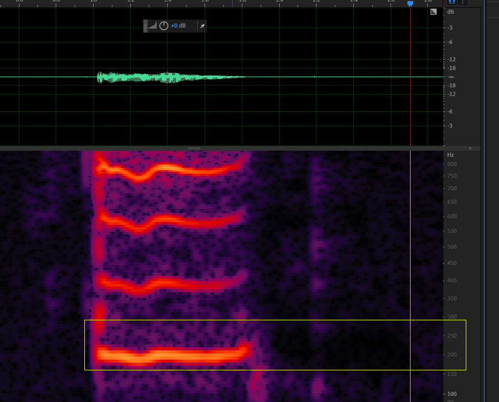
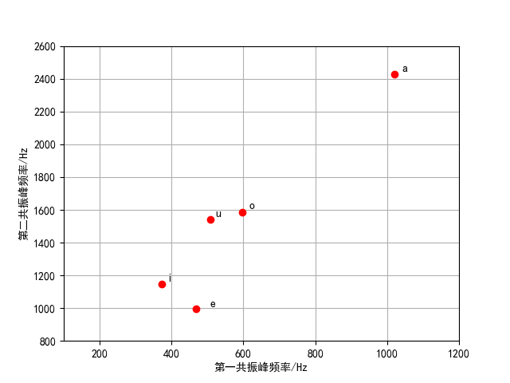

## 1 基音频率

### 1.1 基音频率的查看

基音频率就是发浊音时，气流通过声门使声带产生张弛震荡式振动，产生准周期的激励脉冲串。这种声带振动的频率称为基音频率。

通过软件Audition就可以查看基音频率，语谱图最后一条声纹对应的频率就是基音频率。下图为女性元音’a‘的发音，语音基本信息为：采样率8000Hz，单声道，16位。



通过软件Audition可以直接查看出男性和女性的基音频率，它们分别是：

- 男性说话人的基音频率在50-200Hz
- 女性说话人的基音频率在200-450Hz

## 2 共振峰的获取

### 2.1 倒谱法求共振峰

流程如下：

```mermaid
graph LR
A[预处理] -->B[FFT]
    B --> C[对数幅值谱]
    C --> D[IFFT]
    D --> E[窗函数]
    E --> F[FFT]
```

具体步骤：

倒谱法共振峰估计的算法过程为：

 - 对语音信号$x$进行预加重，并进行加窗，FFT处理
   $$
   X(k)=\sum_{n=1}^Nx(n)e^{-\frac{2\pi kn j}{N}} \tag{2-1}
   $$
   窗函数为汉明窗，长度为320。声音采样频率为8000Hz，FFT长度默认为65536。

 - 取$X(k)$的倒谱：
   $$
   \hat x(n)=\frac{1}{N}\sum_{k=1}^N\lg|X(k)|e^{-\frac{2\pi kn j}{N}} \tag{2-2}
   $$
   
 - 给倒谱信号加窗得：$h(n)=\hat x(n)\times h(n)$,这里的窗函数和倒谱的分辨率有关（和采样率和FFT长度有关）：
   $$
   h(n)=\left \{\begin{array}{lc}
    1&n\leqslant n_0-1 \&n\geqslant N-n_0+1\\
    0& n_0-1<n<N-n_0+1
     \end{array}\right.,n\in[0,N-1] \tag{2-3}
   $$
   式中$n_0$是窗函数的宽度

 - 求包络线

 - 在包络线上寻找极大值，获得相应共振峰参数。

实现代码为：

```python
def Formant_Cepst(u, cepstL):
    """
    倒谱法共振峰估计函数
    :param u:输入信号
    :param cepstL:🔪频率上窗函数的宽度
    :return: val共振峰幅值 
    :return: loc共振峰位置 
    :return: spec包络线
    """
    wlen2 = len(u) // 2
    u_fft=np.fft.fft(u)                         #按式（2-1）计算
    U = np.log(np.abs( u_fft[:wlen2]))
    Cepst = np.fft.ifft(U)                      #按式（2-2）计算
    cepst = np.zeros(wlen2, dtype=np.complex)
    cepst[:cepstL] = Cepst[:cepstL]             #按式（2-3）计算
    cepst[-cepstL + 1:] = Cepst[-cepstL + 1:]	#取第二个式子的相反 
    spec = np.real(np.fft.fft(cepst))
    val, loc = local_maxium(spec)               #在包络线上寻找极大值
    return val, loc, spec
```

### 2.2 测试结果

低通窗函数$n_0=7$。测试男性a1画出波形如图所示：


五元音的前两共振峰的测试结果如下：

| 元音  | 第一共振峰 | 第二共振峰 |
| :---: | :--------: | :--------: |
| a1/a2 | 1021/1044  | 2428/2404  |
| o1/o2 |  596/522   | 1583/1673  |
| e1/e2 |  469/408   |  996/1018  |
| i1/i2 |  372/375   | 1149/1031  |
| u1/u2 |  508/514   | 1543/3494  |

2.3 实现程序

CepstrumFormant.py

```python
from 共振峰估计函数 import *
from scipy.signal import lfilter
import librosa
import numpy as np
import matplotlib.pyplot as plt

plt.figure(figsize=(14, 12))
path="F:\\python\\VowelStuday\\SingleVowel\\aoeiu元音音频\\原始元音男性\\a1.wav"
#path="C4_3_y.wav"
#data, fs = soundBase('C4_3_y.wav').audioread()
data, fs = librosa.load(path, sr=None, mono=False)#sr=None声音保持原采样频率， mono=False声音保持原通道数
# 预处理-预加重
u = lfilter([1, -0.99], [1], data)

cepstL = 7
wlen = len(u)
wlen2 = wlen // 2
print("帧长={}".format(wlen))
print("帧移={}".format(wlen2))
# wlen = 256
# wlen2 = 256//2
# 预处理-加窗
u2 = np.multiply(u, np.hamming(wlen))
# 预处理-FFT,取对数 获得频域图像 取一半
U_abs = np.log(np.abs(np.fft.fft(u2))[:wlen2])
# 4.3.1
freq = [i * fs / wlen for i in range(wlen2)]
#print(freq)
#val共振峰幅值 loc共振峰位置 spec包络线
val, loc, spec = Formant_Cepst(u, cepstL)
plt.subplot(2, 1, 1)
plt.plot(freq, U_abs, 'k')
plt.xlabel('频率/Hz')           #设置x，y轴的标签
plt.ylabel('幅值')
plt.title('男性a的发音频谱')
plt.subplot(2, 1, 2)
plt.plot(freq, spec, 'k')
plt.xlabel('频率/Hz')           #设置x，y轴的标签
plt.ylabel('幅值')
plt.title('倒谱法共振峰估计')
for i in range(len(loc)):
    plt.subplot(2, 1, 2)
    plt.plot([freq[loc[i]], freq[loc[i]]], [np.min(spec), spec[loc[i]]], '-.k')
    plt.text(freq[loc[i]], spec[loc[i]], 'Freq={}'.format(int(freq[loc[i]])))

plt.savefig('images/共振峰估计.png')
plt.show()
plt.close()
```

### 2.3 共振峰位置坐标

以元音的第一共振峰频率为x轴，第二共振峰频率为y轴，将五个元音的前两个共振峰画在一个二维空间中。五个元音是同一个人的发音。



### 2.4 多种情况下的共振峰测试

对于同一个元音，不同性别的发声人在第1共振峰频率和第2共振峰频率的两共振峰的测试结果如下：

| 元音      | 第一共振峰 | 第二共振峰 |
| :-------- | :--------: | :--------: |
| 男性a发音 |    1021    |    2428    |
| 女性a发音 |    1145    |    2364    |
| 男性e发音 |    469     |    996     |
| 女性e发音 |    500     |    1118    |
| 男性i发音 |    372     |    1149    |
| 女性i发音 |    379     |    1106    |
| 男性o发音 |    596     |    1583    |
| 女性o发音 |    617     |    1663    |
| 男性u发音 |    508     |    1543    |
| 女性u发音 |    437     |    2426    |

对于同一个元音，不同性别的发声人在第1共振峰频率和第2共振峰频率的差值如下：

| 元音            | 第一共振峰 | 第二共振峰 |
| :-------------- | :--------: | :--------: |
| a发音男女的差值 |    124     |     64     |
| e发音男女的差值 |     31     |    122     |
| i发音男女的差值 |     7      |     43     |
| o发音男女的差值 |     21     |     80     |
| u发音男女的差值 |     71     |    883     |

从上表可以看出，对于同一个元音，不同性别的发声人在第1共振峰频率的差值控制在200Hz以内，而第1共振峰频率的差值变换幅度较大。

对于同一个元音，不同的发声人（同一性别）在第1共振峰频率和第2共振峰频率的两共振峰的测试结果如下：

|      元音       | 第一共振峰 | 第二共振峰 |
| :-------------: | :--------: | :--------: |
| 01号发声人a发音 |    1021    |    2428    |
| 02号发声人a发音 |    1063    |    2947    |
| 03号发声人a发音 |    1098    |    1849    |

从上表对于同一个元音，不同的发声人（同一性别）在第1共振峰频率的差距不上特别明显，相差大约在40Hz左右，而在第2共振峰频率上的差距就很明显。

从图3.2中很容易看出元音具有更多的能量，并且它集中在较低的频率。无发辅音的能量要低得多，并且通常以更高的频率聚焦。与表达辅音的情况是这两者之间的东西。